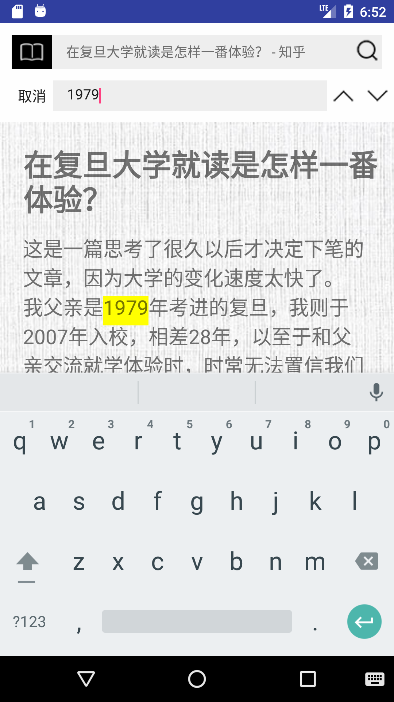
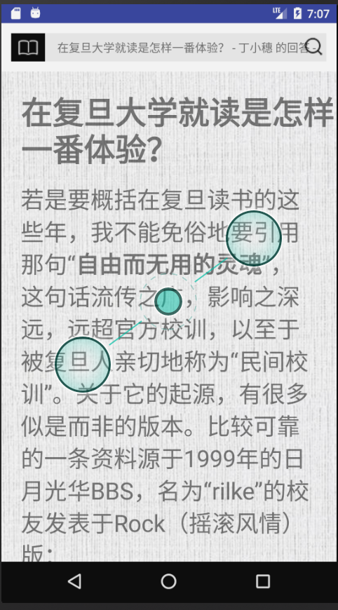

# readingModeBrowser
An Android mobile browser with a custom reading mode feature

## Features
### Turn original webpages to reading mode webpages

      

click the button on the left of the address bar --->  Sliding change  ----------------> Final result

### Search for key words within the webpage

  

click the search button on the right of the address bar and key in word to search

### Adjust font size by pinching

### Adjust lightness by sliding horizontally

